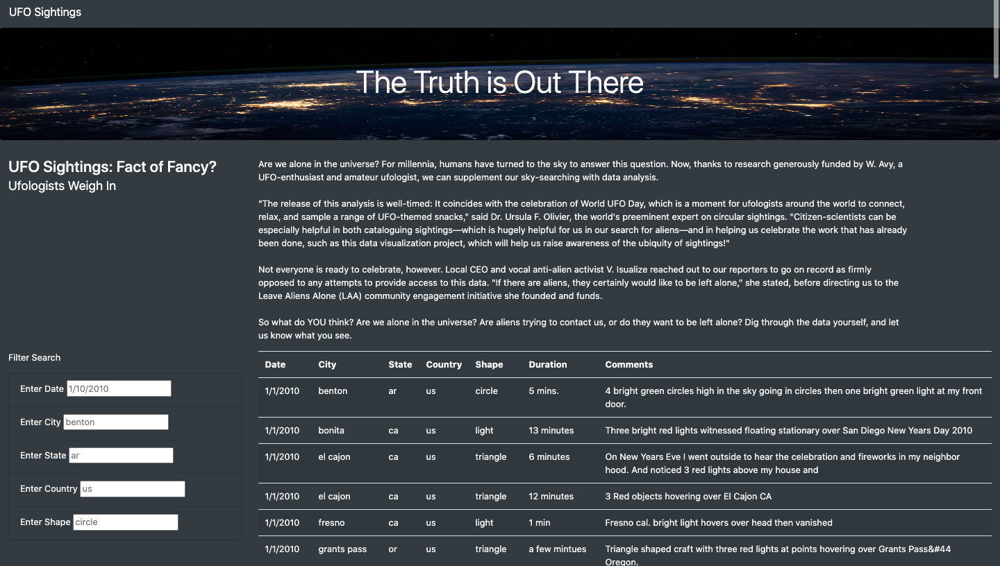

# UFOs

## Overview of Analysis 

In this analysis we used Javascript and HTML to create a webpage that holds a data table of UFO sightings. The webpage also includes a search section that allows users to filter through UFO sightings based on date, city, state, country and shape. This functionality will allow for a more in-depth analysis of the sightings.

## Results 

In the index.html file, we created 5 list elements that will allow the user to filter UFO data based on date, city, state, country and shape. The search bars include placeholder values that give the user an idea of the format in which the values are written. The image below shows the webpage prior to any searches and filtering.

Using Javascript, we created a function to save the element, value and ID of the filter that was changed. Based on the user's input, another function will loop through the UFO data to store only the results that match the search criteria. Upon pressing enter, the table will be rebuilt to display the results that match the search. In the image below, the user is looking for UFO sightings in the state of California (CA). As per the placeholder value, the state abbreviation is written in lowercase letters, ca. The table now only displays the UFO sighting data in the state of California. 

