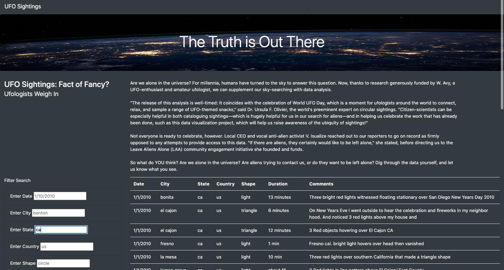
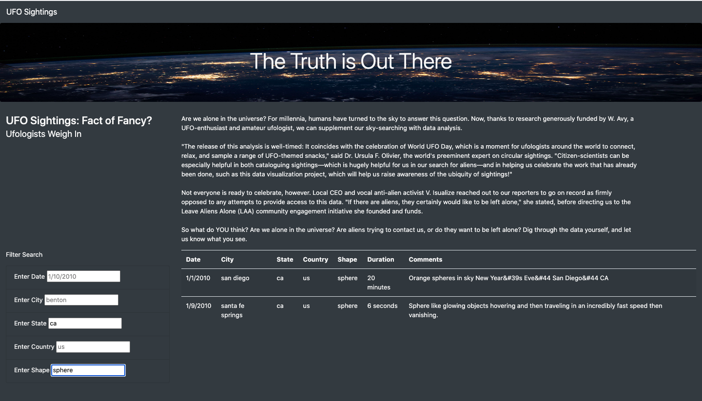

# UFOs

## Overview of Analysis 

In this analysis we used Javascript and HTML to create a webpage that holds a data table of UFO sightings. The webpage also includes a search section that allows users to filter through UFO sightings based on date, city, state, country and shape. This functionality will allow for a more in-depth analysis of the sightings.

## Results 

In the index.html file, we created 5 list elements that will allow the user to filter UFO data based on date, city, state, country and shape. The search bars include placeholder values that give the user an idea of the format in which the values are written. The image below shows the webpage prior to any searches and filtering.

Using Javascript, we created a function to save the element, value and ID of the filter that was changed. Based on the user's input, another function will loop through the UFO data to store only the results that match the search criteria. Upon pressing enter, the table will be rebuilt to display the results that match the search. In the image below, the user is looking for UFO sightings in the state of California (CA). As per the placeholder value, the state abbreviation is written in lowercase letters, ca. The table now only displays the UFO sighting data in the state of California. 

In the image below, the user is filtering for two criteria at the same time, state and shape. The user can first type "ca" in the state search bar, press enter, type "sphere" in the shape search bar and press enter again. Or, the user can type "ca" in the state search bar and immediately go into typing "sphere" in the shape search bar. As soon as the user starts typing in the shape search bar, the table will already be rebuilt and loaded to only include data from California. After typing "sphere" in the shape search bar, the user must press enter to now get a new table that includes the second criteria for shape. The final table will include all spherical UFO sightings in California, as shown below. 

## Summary

### Drawbacks

Although the user can filter for multiple criteria at the same time, the user cannot filter for 2 or more values in the same criteria. For example, the user cannot see the data from both triangular and circular shaped sightings in the same table. Additionally, the values in the table are not written in traditional format, which can affect user experience. Normally the state abbreviations are capitalized, and city names begin with a capital letter, which is not the case on this webpage. Date formats can vary, but typically include double digit month and day (i.e April 1st, 2010 would be 04/01/2010 or some variation of that). On that note, the user also has no indication on whether the month or day comes first when entering the date, which can affect analyses if they misinterpreted the format. 

### Recommendations for Further Development 

1) Another filter search for duration of sighting, which can include a range slider 
2) Adding images of sightings to enhance user experience
3) Include dropdown menus for some of the searches so users can easily choose instead of having to type (leaves room for error)
4) Updating UFO data to include recent sightings (data is only from 2010)
5) Remove case sensitity for city, state, country and shape 
6) Explicitly state the date format 
